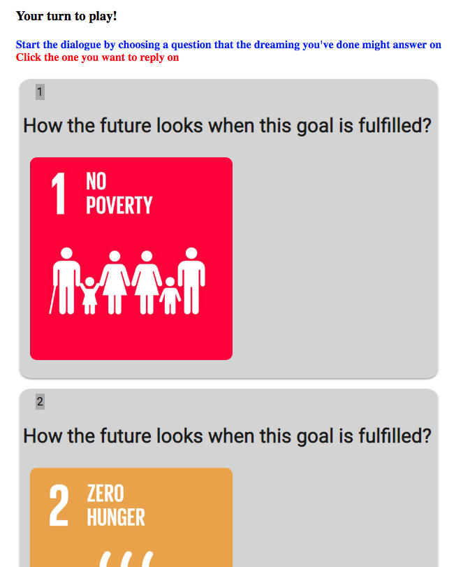
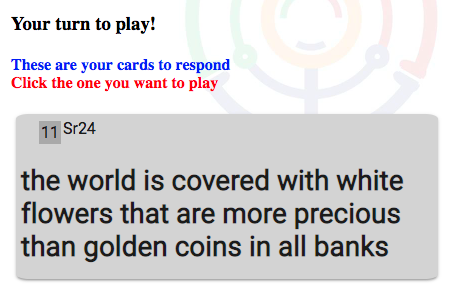
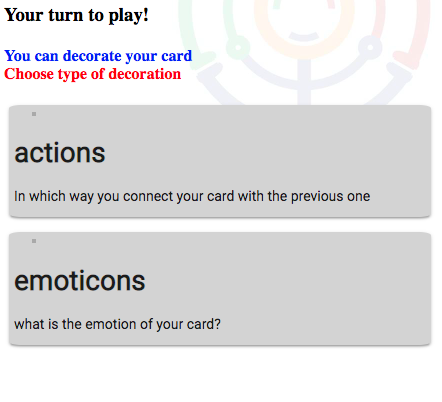
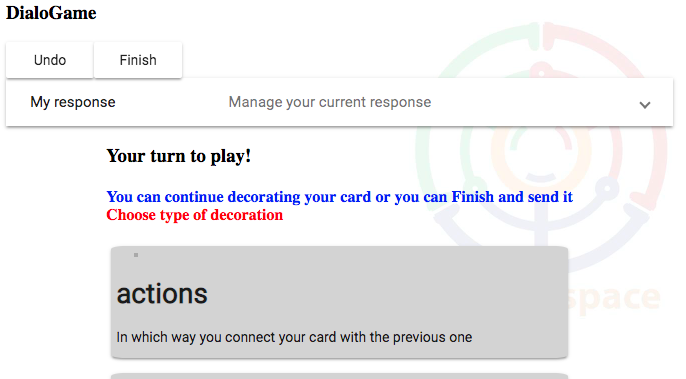
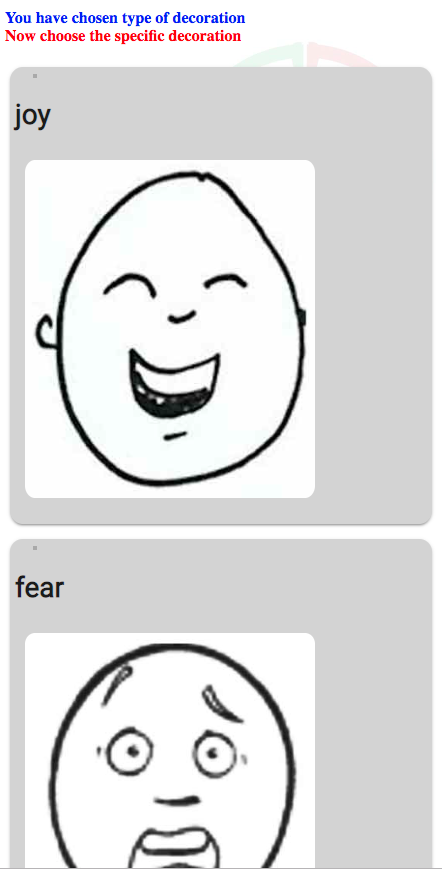
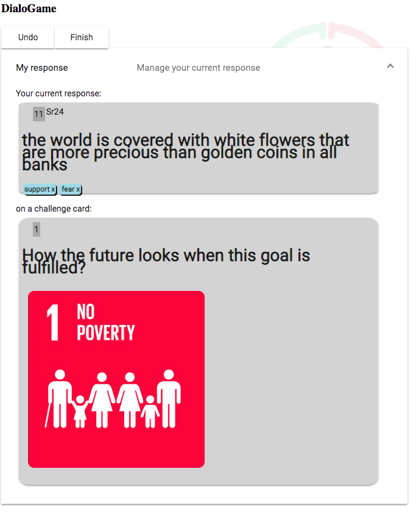
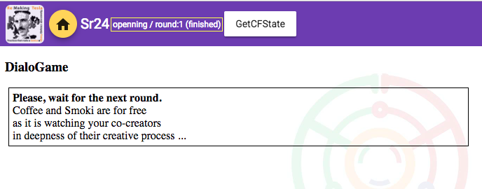

# PSC

## Register/Login

+ If you do not have Colabo.Space account, please create it
+ If you have it, just login

## Select SDG(s)

not needed for CWCs testing

## Create CWCs

Coaching with Compassion / Dreams/ Visions

- create 5 CWCs

## Performative DialoGame

### Opening / Round 1

#### Moderator

- we have to set at the beginning that the correct state by precious next to set up opening state (according to the next illustration)
- 

#### Player

- in **My response** we can see the current move being played
- we choose one of the **17 suggested SDG Question cards** 
  "Start the dialogue by choosing a question that the dreaming you've done might answer on
  Click the one you want to reply on"
  
- then we select some of the suggested respond cards, made out of our CWCs 
  "Your turn to play!
  These are your cards to respond
  Click the one you want to play"
  
- after choosing our response card, we can decorate it with several decorators, divided in 2 groups "actions" and "emoticons"
- 
- 
- 
- In **My Response** we can see our complete response:
  - 
  - we can **delete any decorator** by clicking on it
- we can also go to the previous phase of playing, by pressing the **UNDO** button
- when satisfied, we can click on the upper **FINISH** button
- the following screen appears when we finish playing the current round
- 
- now the player is "blocked" at the end of the first round, waiting for the **moderator** to change the round to the 2nd, when the player's system would automatically initiate new round and show the suggested cards to the player to play on them

#### Moderator

1. wait  to see that **all the players have played the first round**
   1. by refreshing the moderator page and checking the column for the current round
   2. if all players have that column filled
2. when all have played, he press the button to **request similarity suggestion**
3. when all the suggestions have received, moderator press the button **next state** - it inits the new round (for all the <u>online</u> players) as stated above

### Round 2

#### Player

- receives suggestions for challenging cards
  - suggestions are 3 selected cards from the cards other players played in the previous round
- player choses one of this cards that he likes the most as a challenge card
- then he choses on of his cards as a response on the selected challenge card
- the rest is the same ... as in round 1

#### Moderator

- repeats finishing steps from the Round 1

### Round 3

#### Player

- same as round 2

## Database Reseting

### Hard Reset

- the easiest is to delete all the *knodes* and *kedges* from the current maps (with the current MapId)

```mongo
db.getCollection("knodes").remove({ mapId: ObjectId("5be3fddce1b7970d8c6df406")})
db.getCollection("kedges").remove({ mapId: ObjectId("5be3fddce1b7970d8c6df406")})

// reseting colaboflow.state:
db.getCollection("knodes").updateMany({type: 'colaboflow.state', mapId: ObjectId("5be3fddce1b7970d8c6df406")}
, { $set: { "dataContent.playRound" : NumberInt(1), "dataContent.state" : NumberInt(1) } })
```

- and import initializing *knode* and *kEdge* json-s:

### Soft Reset - keeping existing

- **preserving**

  - created users
  - CWCs

- **reset played cards**

  - delete ***cwc.dataContent.dialoGameReponse*** from all CWCs with the current MapId
  - delete played **edges**

- reseting ***colaboflow.state***
  - you can use moderator panel to go to the previous state until it's
  - 
  - or you can use it but you can achieve it by setting it in the db in the knode of type: colaboflow.state to state = 1;

- delete all *knodes* of type **'service.result.dialogame.cwc_similarities'**

- **queries**:

  ```mongo
  db.getCollection("knodes").updateMany( { type: "topiChat.talk.chatMsg", mapId: ObjectId("5be3fddce1b7970d8c6df406")}, { $unset: { 'dataContent.dialoGameReponse': '' } } )
  
  db.getCollection("kedges").remove({ type: "dialogame.response",  mapId: ObjectId("5be3fddce1b7970d8c6df406")})
  
  db.getCollection("knodes").updateMany({type: 'colaboflow.state', mapId: ObjectId("5be3fddce1b7970d8c6df406")}, { $set: { "dataContent.playRound" : NumberInt(1) } })
  
  db.getCollection("knodes").deleteMany({ type: "service.result.dialogame.cwc_similarities", mapId: ObjectId("5be3fddce1b7970d8c6df406")})
  ```

  ### Exporting results of the play

  ```mongo
  db.getCollection("knodes").
  find( { type: "topiChat.talk.chatMsg", mapId: ObjectId("5be3fddce1b7970d8c6df406")})
  
  db.getCollection("kedges").find({ type: "dialogame.response",  mapId: ObjectId("5be3fddce1b7970d8c6df406")})
  
  db.getCollection("knodes").find({ type: "service.result.dialogame.cwc_similarities", mapId: ObjectId("5be3fddce1b7970d8c6df406")})
  ```

  ## Extracting players from the map
